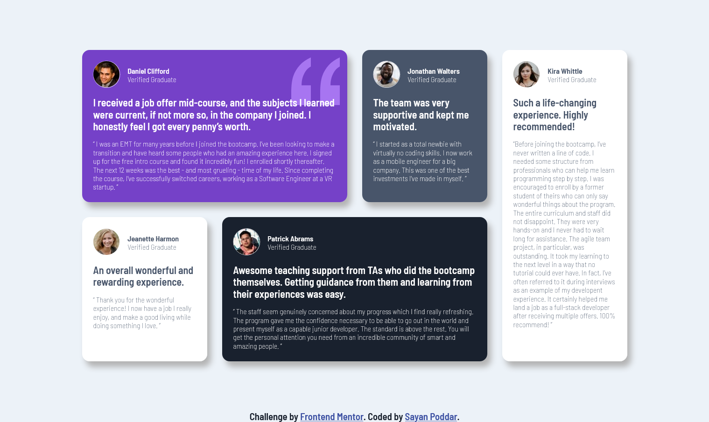

# Frontend Mentor - Testimonial Grid Section

## Table of contents

- [Overview](#overview)
  - [The challenge](#the-challenge)
  - [Screenshot](#screenshot)
  - [Links](#links)
- [My process](#my-process)
  - [Built with](#built-with)
  - [What I learned](#what-i-learned)
  - [Continued development](#continued-development)
  - [Useful resources](#useful-resources)
- [Author](#author)

## Overview

### The challenge

Your challenge is to build out this testimonials grid section and get it looking as close to the design as possible.

You can use any tools you like to help you complete the challenge. So if you've got something you'd like to practice, feel free to give it a go.

Your users should be able to:

- View the optimal layout for the site depending on their device's screen size

Want some support on the challenge? [Join our Slack community](https://www.frontendmentor.io/slack) and ask questions in the **#help** channel.

### Screenshot

### Links

- Question URL: [Click Here](https://www.frontendmentor.io/challenges/testimonials-grid-section-Nnw6J7Un7/hub/testimonials-grid-section-208z_ztkW)
- Live Site URL: [Click Here](https://decodewithhappy.github.io/Testimonials-grid-section-main/)

## My process

### Built with

- Semantic HTML5 markup
- CSS custom properties
- Flexbox
- CSS Grid

### What I learned

I learned how to use Flexbox and Grid properly. How to use CSS in a proper way to make good design.

### Continued development

In my upcoming projects I would like to deploy bootstrap and js which will further add responsiveness and several features.

### Useful resources

- [Adobe Color](https://color.adobe.com/create/color-wheel) - This is a very good resource to get a varieties of color . I really liked the color wheel and will use it going forward.
- [Font Awesome](https://fontawesome.com/) - Here we can get several icons, logos which can be used in various places.
- [Google Fonts](https://fonts.google.com/) - A good resource through which we can get different types of fonts.

## Author

- Website - [Sayan Poddar](https://github.com/DecodewithHappy/Testimonials-grid-section-main)
- Frontend Mentor - [@DecodewithHappy](https://www.frontendmentor.io/profile/DecodewithHappy)
- Linkedin - [@SayanPoddar](https://www.linkedin.com/in/sayan-poddar-71777222a/)
